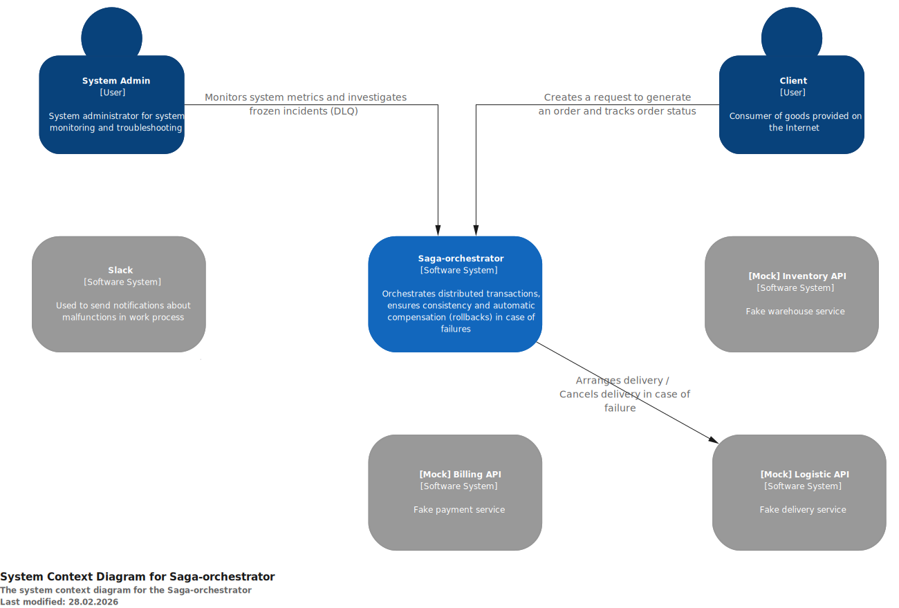
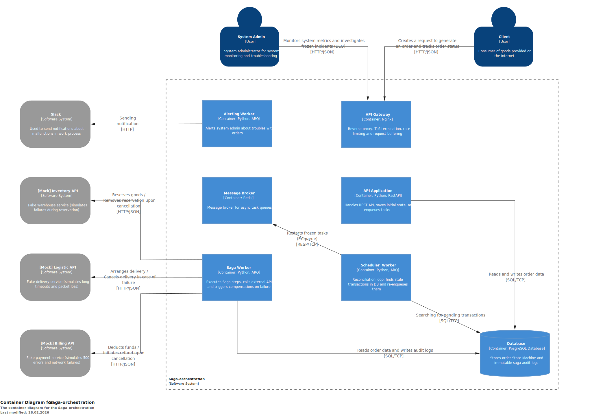

# 🚦 Saga Orchestrator Pattern


[](https://opensource.org/licenses/MIT)

## Overview

This project implements the **Saga Choreography/Orchestration Pattern** to manage distributed transactions across microservices. Instead of relying on traditional 2-Phase Commit (2PC) protocols which are synchronous and block resources, this service uses event-driven asynchronous queues to divide a global business transaction (like an Order execution) into sequential and parallel local steps (Billing, Inventory, Logistics).

It provides a high-performance REST API to receive requests, utilizing a centralized worker architecture to strictly govern state transitions. If any individual step in an ongoing business transaction fails, the orchestrator autonomously initiates a series of compensating transactions to gracefully roll back any previously applied changes, ensuring eventual consistency.

## Features

*   **Saga Orchestrator**: Centrally coordinates distributed transactions through automated, state-driven transition logic.
*   **Asynchronous Queues (ARQ)**: High-performance background task processing natively backed by Redis to manage states off the main event loop.
*   **Parallel Execution**: Concurrently contacts multiple subdomains (e.g., Inventory and Logistics) using `asyncio.gather` to optimize latency once dependent steps succeed.
*   **Smart Failure Compensation**: Auto-detects exactly which sub-transactions succeeded and exclusively runs localized reverse/rollback actions (`/refund`, `/release`, `/cancel`).
*   **Observability**: Integrated Prometheus instrumentation for application metrics.
*   **Alerts**: [TODO].

## Architecture

### System Context (C1)
This diagram illustrates the high-level boundaries of the Saga Orchestrator system. It displays how external users and systems interact with our core service to initiate complex order flows. 



### Container Diagram (C2)
The container breakdown demonstrates the internal structure: the FastAPI API Gateway, the PostgreSQL persistence layer, the Redis queue, and the background ARQ workers that perform the actual SAGA choreography.



## Tech Stack

| Layer | Technology | Role |
| :--- | :--- | :--- |
| **API Framework** | FastAPI (0.115) | Provides the asynchronous REST interface and data validation (Pydantic). |
| **Database** | PostgreSQL 16 (asyncpg) | Primary data persistence for Order states, User accounts, and Saga Logs. |
| **Message Broker** | Redis 7 & ARQ | Task queue backend and message broker for the background workers. |
| **ORM & Migrations** | SQLAlchemy 2.0 & Alembic | Asynchronous database interactions and schema versioning. |
| **Reverse Proxy** | Nginx | Manages incoming HTTP routing natively in the Docker network. |
| **Metrics** | TBA | TBA |

## Quick Start

### 1. Configure Environment 
Copy the provided environment template to establish your local configuration credentials.
```bash
cp .env.example .env
```

### 2. Build and Spin Up Docker Compose
The system is fully containerized. A single command provisions the database, cache, api router (Nginx), workers, mock environments, and automatically applies Alembic migrations via a dedicated `migrator` service.
```bash
docker-compose up -d --build
```

### 3. Verify Health
Once Docker indicates all containers are running, you can interact with the API:
- **API Docs (Swagger UI)**: http://localhost/docs
- **Mock Microservices (Billing, etc.)**: Runs internally on port 8080.

To check background worker logs:
```bash
docker logs saga_worker -f
```

---
*For detailed API interactions and a visual of the exact SAGA state machine, check out [`docs/API.md`](docs/API.md) and [`docs/architecture/SAGA_ORCHESTRATOR.md`](docs/architecture/SAGA_ORCHESTRATOR.md).*