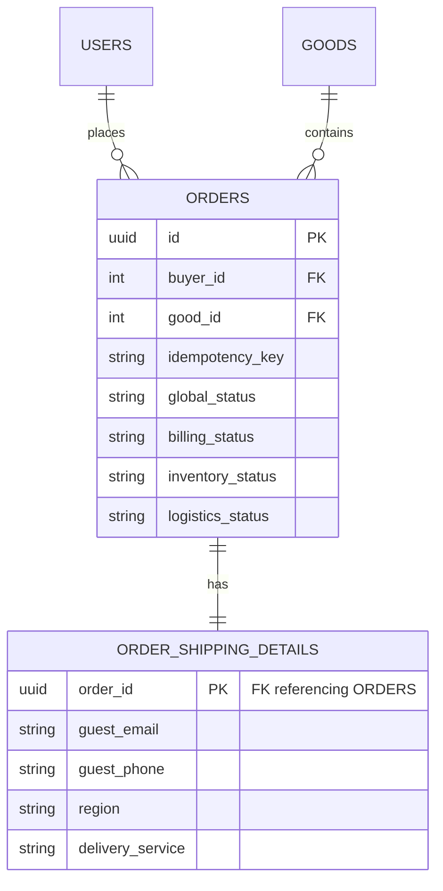

# Database & Migrations

This document explains the schema of the application database and the migration lifecycle.

## Main Tables & Schema

The core domain relies on PostgreSQL as its primary data store. The database models are defined in `src/db/models/`.

### 1. `orders` (Source: `src/db/models/order.py`)
The central entity for the SAGA orchestration.
- **Primary Key**: `id` (UUID).
- **Foreign Keys**: `buyer_id` (Users), `good_id` (Goods).
- **Fields of note**:
  - `idempotency_key` (Unique String): Prevents duplicate orders.
  - `global_status` (Enum: PROCESSING, COMPLETED, CANCELLED, COMPENSATING, MANUAL_INTERVENTION_REQUIRED).
  - Component sync statuses: `billing_status`, `inventory_status`, `logistics_status` (Enum: PENDING, SUCCESS, FAILED, COMPENSATED, SKIPPED, CANCELLED).
- **Relationships**: 1-to-1 with `order_shipping_details`.

### 2. `order_shipping_details` (Source: `src/db/models/order_shipping_detail.py`)
Stores PII (Personally Identifiable Information) and delivery context for the order.
- **Primary/Foreign Key**: `order_id` (UUID). This enforces a strict 1-to-1 relationship at the database level.
- **Fields**: `guest_email`, `guest_phone`, `region`, `city`, `delivery_service`, `postal_address`.

---

## Entity Relationship Diagram

## Migrations (Alembic)

Database schema evolution is managed by Alembic (`src/db/migrations/`). Revisions live in `src/db/migrations/versions/`.

When running in docker (via `docker-compose.yml`), a dedicated `migrator` service runs `poetry run alembic upgrade head` on startup before the API and Workers spin up. 

**Common Commands (run locally via poetry):**
- **Generate new migration**: `alembic revision --autogenerate -m "description"`
- **Apply migrations**: `alembic upgrade head`
- **Rollback 1 step**: `alembic downgrade -1`

## Database Seeding

To simplify local development and testing, the application automatically seeds the database with initial data (like available goods) when the API server starts. 

This is handled inside the application's `lifespan` context manager in `src/main.py`, which calls the seeding script `src/core/seed.py`.

The seeding mechanism ensures that it only inserts data if the `goods` table is currently empty, preventing duplicate entries across multiple container restarts.