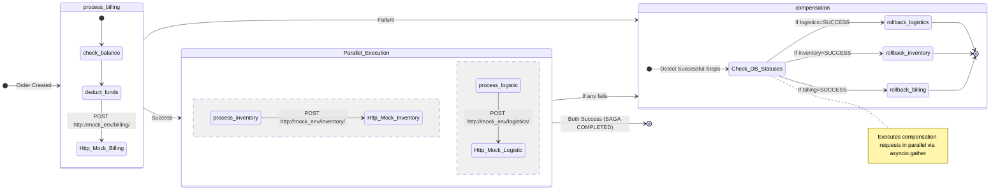

# Saga Orchestrator Architecture

This document outlines the background business logic driven by the Saga orchestration pattern implemented with ARQ.

## State Machine & Transitions

The Saga pattern manages distributed transactions across our microservices (or modules). Instead of a two-phase commit, local transactions execute sequentially. If any transaction fails, a series of compensating transactions runs in reverse order to rollback state. 

Here is how the saga orchestrator routes tasks (`billing` $\rightarrow$ parallel `inventory` and `logistics`), interacts with mock microservices, and delegates to a smart `compensation` logic on failure:

## Lifecycle Events (`lifecycle.py`)

The ARQ worker uses explicit startup and shutdown lifecycle hooks to manage background dependencies without affecting the main API server:

- **Startup (`startup`)**: 
  - Initializes logging for the worker process.
  - Sets up an asynchronous HTTP client pool (`httpx.AsyncClient`) injected into the worker context (`ctx["http_client"]`).
  - Injects the database session factory (`ctx["session_factory"]`) to handle DB transactions locally for tasks.
- **Shutdown (`shutdown`)**:
  - Gracefully closes the HTTP client (`httpx.AsyncClient.aclose()`).
  - Disposes the SQLAlchemy engine (`engine.dispose()`) to close all DB connections safely.

## Coordination & Failure Handling (`main_worker.py`)

The SAGA sequence is coordinated through distributed queues using ARQ connecting to Redis.

**Task Enqueuing & Handoff**:
- The worker executes initial tasks and triggers consequent ones using the ARQ `enqueue_job` method.
- **Parallel processing:** Unlike a strictly sequential saga, after `process_billing` successfully completes, it enqueues both `process_inventory` and `process_logistic` to run concurrently (`asyncio.gather`).
- **Mock Microservices (`mock_env`):** Rather than doing the logic internally, tasks make HTTP requests (`http_client.post`) to lightweight mock services representing `billing`, `inventory`, and `logistics` subdomains.

**Handling Failures & Retries (Anti-flapping)**:
- If a mock microservice responds with a non-200 status code, or a network exception is thrown, the task marks the state as `FAILED` and explicitly pushes the order context to the `compensation` function.

**Smart Compensation Execution (`compensation.py`)**: 
- The compensation function isn't a hardcoded cascade; it is strictly state-driven. 
- It reads the DB and checks the `SagaStepStatus` of each participant (`billing_status`, `inventory_status`, `logistics_status`). 
- If any service is still `PENDING`, the task exits gracefully (no exception) and waits for the scheduler-driven re-dispatch cycle.
- If a step was effectively `SUCCESS`, it dynamically enqueues an HTTP request to its respective rollback endpoint (e.g. `/refund` for billing, `/release` for inventory, `/cancel` for logistics). These rollback actions are fired simultaneously via `asyncio.gather`.
- For partial compensation failures, the task performs a soft retry by manually re-enqueuing `compensation` with a short defer and an explicit `retry_count` argument, instead of failing the ARQ job with `raise`.
## Scheduler & Stuck Orders (`scheduler.py`)

In distributed systems, transactions can sometimes get "stuck" in a processing or compensating state due to unexpected crashes, networking outages, or unrecoverable external failures. To guarantee eventual consistency, a dedicated **Scheduler Worker** is employed using ARQ's `cron` feature.

**Periodic Polling**:
- The scheduler runs on a dedicated Redis queue (`saga:scheduler`) to prevent interference with the high-throughput task queue.
- It periodically queries the database for orders stuck in `PROCESSING` or `COMPENSATING` beyond a defined timeout.
- Cron schedule:
  - `poll_and_dispatch_orders`: every 30 seconds (`second={0, 30}`).
  - `check_and_alert_dead_orders`: every 10 minutes (`minute={0, 10, 20, 30, 40, 50}`).

**Automated Recovery & Alerts**:
- Orders stuck in `PROCESSING` are automatically dispatched to the `compensation` task to forcefully roll them back. To bypass ARQ's built-in job result caching and ensure the compensation job is successfully re-enqueued (even if previous attempts failed and their results were cached), the scheduler appends a unique timestamp to the `_job_id`.
- Orders globally stuck in a `COMPENSATING` state point to a critical rollback failure. These are transitioned to a `MANUAL_INTERVENTION_REQUIRED` state and trigger webhook alerts to external notification services.
